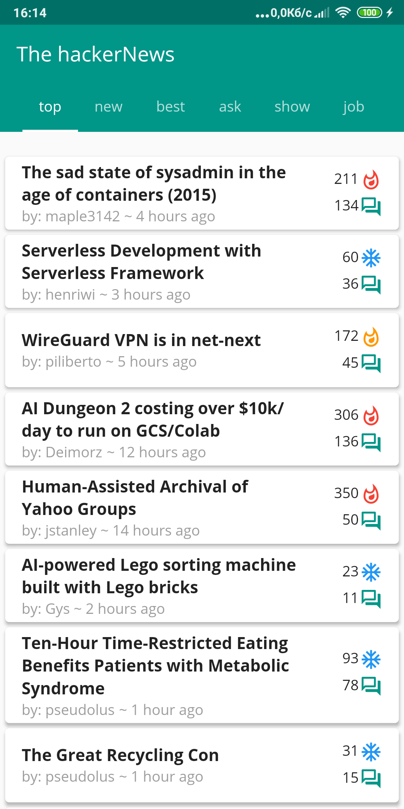
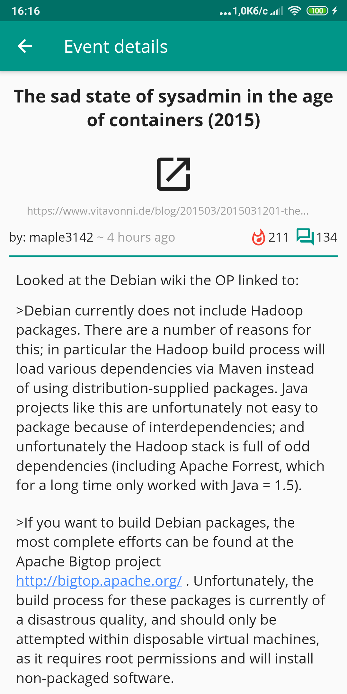
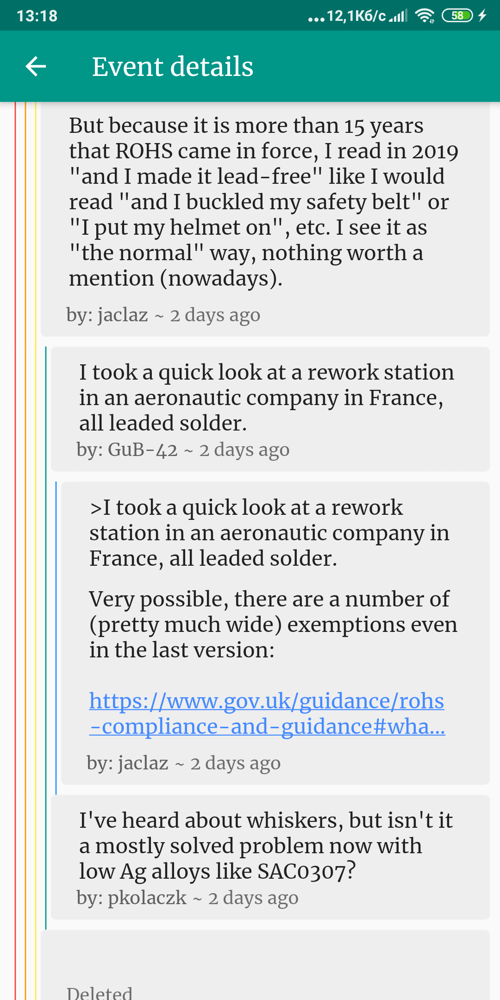
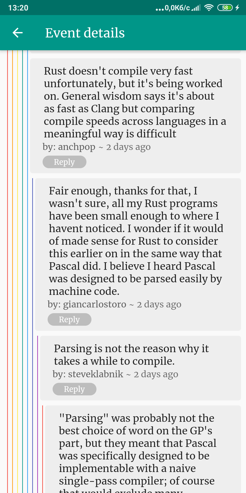
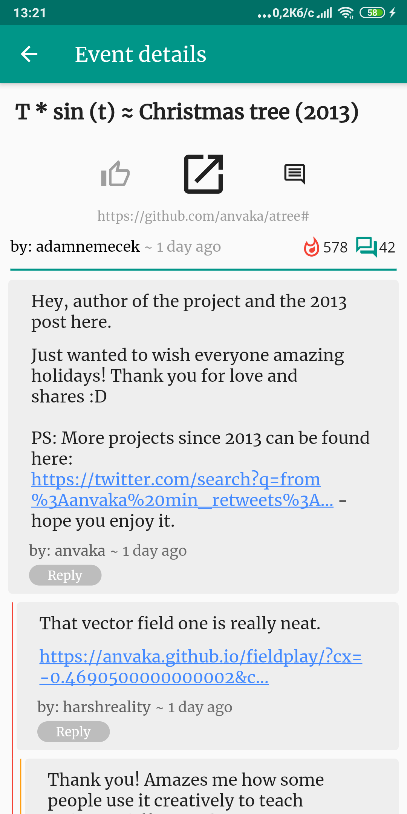
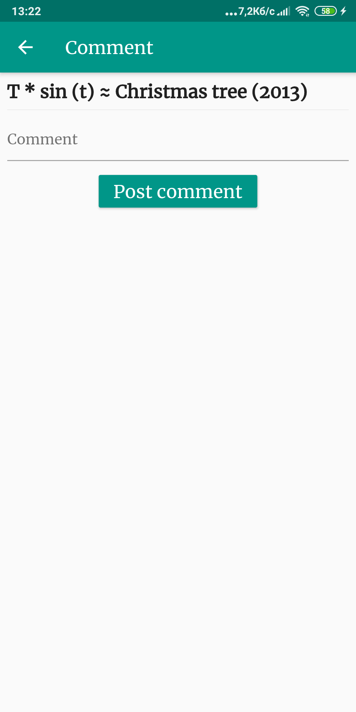
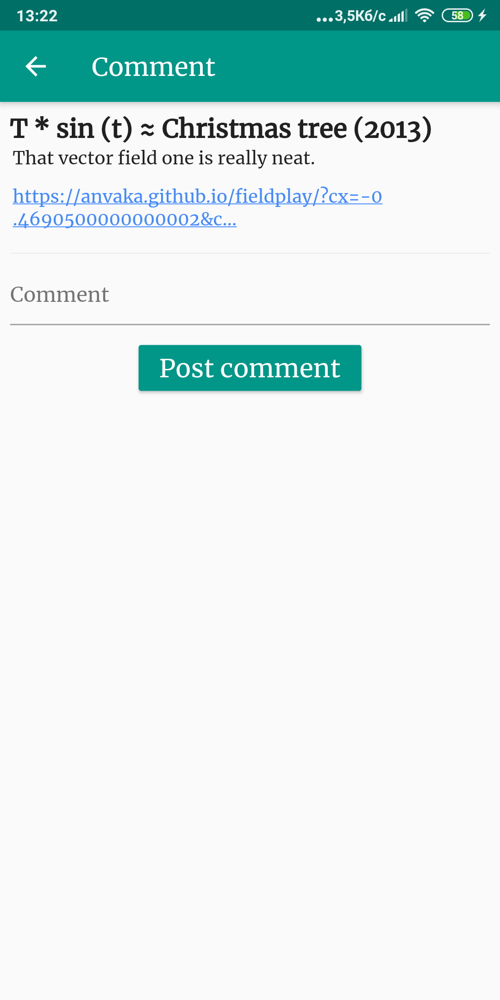

# hacker_news

Just another client for HackerNews service.

## Not authenticated user
<ul>
    <li>
        

            
            
        

    </li>
    <li>
        

        
        
        

    </li>
</ul>

## Authenticated user
<ul>
    <li>
        

            
            
            
        

    </li>
    <li>
        

        
        
        
        

    </li>
    <li>
        

        
        

    </li>
</ul>
